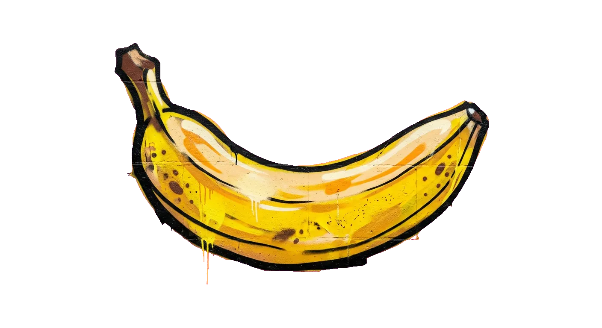

<p align="center">
  
</p>

<h1 align="center">Banana City</h1>

<p align="center"><em>A shared 3D world built entirely out of prompts.</em></p>

<p align="center">
  <!-- DEPLOY-URL: replace with the live URL (also update index.html) -->
  <a href="https://REPLACE-WITH-DEPLOY-URL"><strong>Visit the city →</strong></a>
</p>

---

Nothing in Banana City was modeled by hand. Every object standing in it was
described in a sentence by someone who wandered through, generated on the spot,
and left where they dropped it. Walk in and you're not looking at a demo scene —
you're looking at what previous visitors decided should exist.

The loop is short enough to finish in about twenty seconds:

1. Press <kbd>E</kbd> and describe anything you want to exist.
2. It's generated, cut out from its background, and handed to you to place.
3. You drop it. It's saved. The next person to arrive walks past it.

There is no account, no moderation queue, and no undo. The world is whatever
people have left in it.

## How it works

The interesting problem here isn't generating an image — it's turning a
rectangular image into something that reads as an *object* in a 3D space, without
a human in the loop.

**Chroma key, without a green screen.** Every user prompt is wrapped in a
scaffold that asks for the subject isolated on a solid green (or magenta)
background with flat studio lighting and no shadows or floor contact. The
returned PNG is decoded to raw RGBA and keyed per-pixel in `sharp`: pixels whose
"greenness" (`g - max(r, b)`) exceeds a threshold are cut fully transparent,
while pixels in the fringe band get a proportional alpha so edges stay soft
instead of aliasing into a sticker outline. Magenta is offered as a fallback for
subjects that are themselves green. The result is written as WebP with an alpha
channel.

**Objects vs. residents.** A placed image is a billboarded quad that turns to
face the camera. Flag one as a *character* and it gains a proximity radius and a
dialog script — walk inside the radius and it speaks, with the text typing itself
out one character at a time. Each dialog line can also store a camera position
and quaternion, so a character can frame its own shots as it talks, and can fire
a sound on the last line.

**Editing from inside the world.** There's no separate editor mode. Hold click on
anything and a transform gizmo appears in place, with translate/rotate/scale
bound to <kbd>G</kbd>/<kbd>R</kbd>/<kbd>T</kbd>, snap-to-ground, and multi-select
for moving groups. Changes write straight through to the server.

**Persistence.** Express + SQLite. Images live on disk in `data/images/`, their
prompts and transforms live in the database, and the schema migrates itself
forward on boot by inspecting `PRAGMA table_info` — the world survives redeploys
without a migration tool.

**Keeping the generator from being drained.** Generation is the only route that
costs money, so it's the only one that's gated. Every image requires a token the
page mints from `POST /api/generation-token` immediately beforehand: an HMAC over
a nonce, an expiry, and a keyed fingerprint of the caller's IP. Tokens live two
minutes, are good for exactly one image, and are checked with a constant-time
compare. Requests arriving without an `Origin` — which is every bare script, since
browsers always attach one to a POST — are refused outright, as are requests from
any origin that isn't the page's own. Underneath both sits a sliding-window rate
limit per IP, counted *before* the call to Gemini, because a request costs money
whether or not an image comes back.

All of it self-configures. The signing key is generated on first boot and kept
beside the database, so tokens survive restarts; `X-Forwarded-For` is trusted only
when the connection came from a private address, so the rate limiter sees real
client IPs behind a proxy but can't be spoofed by a direct caller; and the
loopback-origin allowance that makes the Vite dev proxy work is only live when the
request itself arrived on loopback, so it's dead on a deployed instance.

None of this can stop a headless browser driving the real page, and it isn't meant
to — the page is public. What it stops is the cheap version: `curl` pointed at the
endpoint, another site calling it from a user's browser, and one host generating
in bulk.

**Movement.** First-person controls with gravity, jump, sprint, and pointer lock
on desktop; a virtual joystick and touch-look on mobile. HDR environment lighting
from an `.hdr` sky, and an FBX banana as the one piece of geometry that isn't
someone's prompt.

## Stack

| | |
|---|---|
| **Rendering** | Three.js, React Three Fiber, `@react-three/drei` |
| **Frontend** | React 19, TypeScript, Vite |
| **Backend** | Express 5, SQLite (`sqlite3` + `sqlite`) |
| **Generation** | Gemini (`@google/genai`), `gemini-3.1-flash-image-preview` |
| **Image pipeline** | `sharp` — raw RGBA chroma keying, WebP encode |

## Running it locally

You'll need Node 20+ and a [Gemini API key](https://aistudio.google.com/apikey).

```bash
git clone https://github.com/hankberger/banana-city
cd banana-city
npm install
```

Copy `.env.example` to `.env` and drop your key in:

```
GEMINI_API_KEY=your_key_here
PORT=3000
```

That's the whole configuration. `.env.example` lists a few optional knobs for the
generation limits, but their defaults are correct both locally and on a normal
deploy — there's nothing you have to set to ship this.

Then run the Vite dev server and the API server side by side:

```bash
npm run dev        # Vite dev server on :5173
npm run dev:server # API server on $PORT
```

Vite proxies `/api` and `/images` through to the API server using the `PORT`
from your `.env`, so open http://localhost:5173 and both halves are wired up.

For a production build:

```bash
npm run build      # builds client into dist/ and server into dist-server/
npm start
```

> **Note:** a fresh clone starts as an empty world. `data/` is gitignored, so no
> images or scene objects ship with the repo — the first thing you generate is
> the first thing in your city.

## Repo layout

```
src/App.tsx          UI shell — creator panel, gallery, dialog, pause, loading
src/ThreeScene.tsx   the world — controls, physics, billboards, gizmos, characters
server.ts            API, chroma-key pipeline, generation gate, SQLite migrations
.env.example         every setting, with notes on which matter in production
public/              static assets — HDR sky, FBX model, jazz track
data/                generated images + database (gitignored, created on boot)
```

## Collaborating

**On the world.** Just visit and press <kbd>E</kbd>. Anything you make is public
and permanent, and it's the only thing anyone else will see of you — so make it
count. Bear in mind there's no moderation and no way to reclaim a spot once
someone builds over it.

**On the code.** Issues and pull requests are welcome. Some things I'd genuinely
like help with:

- **Mobile creation.** Mobile visitors can currently explore but not build — the
  creator panel is desktop-only. The styling for a mobile entry point already
  exists in `App.css` (`.mobile-creator-btn`) but was never wired up.
- **Edge quality on keying.** The fringe threshold is a fixed constant. Subjects
  with fine detail (hair, smoke, glass) key poorly and would benefit from an
  adaptive or matting-based approach.
- **Spatial indexing.** Every scene object is loaded and considered every frame.
  This is fine at the current scale and won't be at ten times it.

If you're picking one up, open an issue first so we don't both build it.

## Notes

Built by [Hank Berger](https://www.linkedin.com/in/hankberger/) —
[GitHub](https://github.com/hankberger) ·
[X](https://x.com/h4nkdog) ·
[Instagram](https://www.instagram.com/h4nkdog/)
